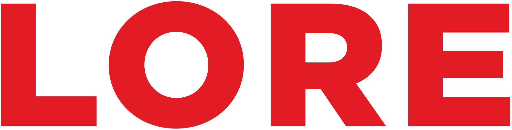

  
   
  <h1></h1>
   

<!-- ||| -->

     
    <h2>🌏 Table of Contents 🌏</h2>
     

### 1. <a href="#description">Description</a>

### 2. <a href="#link">Link</a>

### 3. <a href="#stack">Stack</a>

### 4. <a href="#team">Team</a>

### 5. <a href="#license">License</a>

<!-- ||| -->

     
    <h2>🌟 Description 🌟</h2>
     

    <b>
        ❗ 100% accurate information is not presented here, since everything written and shown is based on personal experience and documentation, which may change by the time you use this repository. ❗
    </b>
    

        This repository contains information, or a memo, about various technologies in various areas of programming and everything connected with it.
        In essence, this is a collection in which most often there is a story and examples of the achievements of people who decided to share their experience.
    

    <b>🔥 If you want to add or correct errors, you can create a "fork" and upload it. 🔥</b>

<!-- ||| -->

     
    <h2>🔒 Link 🔒</h2>
     

### 1. <a href="https://github.com/kah3vich/lore/tree/master/web/front/state-management/nanostore/readme.md">Nanostore</a>

<!-- ||| -->

     
    <h2>🔥 Languages & Frameworks & Tools & Abilities 🔥</h2>
     

<table align="center">
  <tr>
    <td align="center" width="96">
      
       
      
NanoStore

    </td>
  </tr>
</table>

<!-- ||| -->

     
    <h2>🧠 Core Team 🧠</h2>
     

<table align="center">
    <tr>
        <td align="center" valign="top">
            
             
            <a href="https://github.com/kah3vich">Kah3vich</a>
            
Core Developer

        </td>
    </tr>
</table>

<!-- ||| -->

     
    <h2>✅ License ✅</h2>
     

## [GNU - free software license.](LICENSE)

<!-- ! by kah3vich -->
